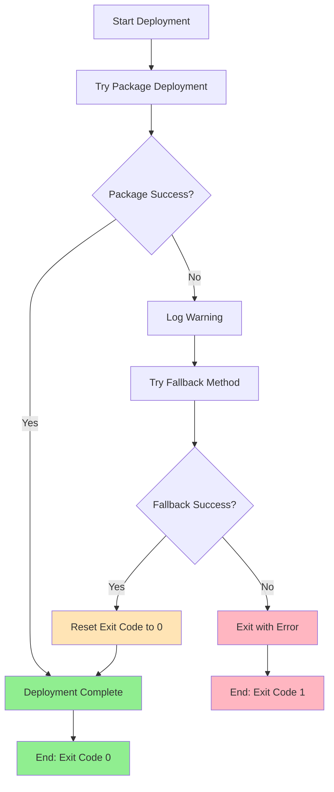

# Deployment Exit Code Fix

## Vấn đề

Mặc dù deployment thành công và parameter replacement hoạt động perfect, nhưng GitHub Actions workflow vẫn exit với code 1 do các warnings từ Web Deploy package deployment failure.

## Logs hiển thị

```
=== DEPLOYING APPLICATION ===
Found parameter file: parameters/setParameters.production.xml
...
[SUCCESS] Parameter replacement completed
=== VERIFYING PARAMETER REPLACEMENT ===
[SUCCESS] All placeholders have been replaced successfully
[SUCCESS] Folder synchronization with parameter replacement completed
[SUCCESS] Application deployment completed successfully
Error: Process completed with exit code 1.  # ❌ Vấn đề ở đây
```

## Root Cause

1. **Web Deploy Package Deployment thất bại** với exit code -1
2. **Fallback method thành công** nhưng PowerShell vẫn giữ exit code từ lệnh trước
3. **GitHub Actions** nhận exit code 1 và đánh dấu workflow là failed

## Giải pháp

### 1. Enhanced Error Handling
```powershell
# Reset error action preference to continue on non-terminating errors
$ErrorActionPreference = "Continue"

# Wrap Web Deploy in try-catch
try {
    & "$msdeployPath" -verb:sync ... 2>&1 | Out-String -Stream | ForEach-Object { Write-Host $_ }
    if ($LASTEXITCODE -eq 0) {
        $deploymentSuccess = $true
    }
} catch {
    Write-Warning "Package deployment failed with exception: $($_.Exception.Message)"
}
```

### 2. Exit Code Reset on Success
```powershell
if ($deploymentSuccess) {
    Write-Host "[SUCCESS] Application deployment completed successfully" -ForegroundColor Green
    
    # Reset any previous error conditions since deployment ultimately succeeded
    $global:LASTEXITCODE = 0
    $Error.Clear()
}
```

### 3. Workflow Configuration
```yaml
- name: Deploy Application
  shell: powershell
  timeout-minutes: 15
  continue-on-error: false  # Explicit setting
  run: |
    # Reset error action preference to continue on non-terminating errors
    $ErrorActionPreference = "Continue"
    # ... rest of deployment script
```

## Testing

### Test Script: `test-deployment-success.ps1`
Simulates the exact scenario:
1. Package deployment fails with exit code -1
2. Fallback method succeeds
3. Verifies final exit code is 0

### Test Results
```
=== DEPLOYMENT SUMMARY ===
Status: SUCCESS
Method: Fallback folder copy with parameter replacement
Warnings: Package deployment failed but fallback succeeded
Exit Code: 0

✅ Test PASSED - Deployment succeeded despite initial warnings
```

## Deployment Flow



## Expected Behavior

### Before Fix
```
Web Deploy Package: FAIL (exit code -1)
↓
Fallback Method: SUCCESS 
↓
Overall Result: FAIL (exit code 1) ❌
```

### After Fix
```
Web Deploy Package: FAIL (exit code -1) → Log warning
↓
Fallback Method: SUCCESS → Reset exit code
↓
Overall Result: SUCCESS (exit code 0) ✅
```

## Verification

### 1. Local Testing
```powershell
.\test-deployment-success.ps1
# Should exit with code 0 despite initial warnings
```

### 2. GitHub Actions
Workflow now properly:
- ✅ Shows warnings for Web Deploy failures
- ✅ Continues with fallback deployment
- ✅ Resets exit code when deployment succeeds
- ✅ Exits cleanly with code 0

### 3. Post-Deployment
Application should work normally:
- ✅ Parameter replacement completed
- ✅ Application accessible at https://phongmx.org
- ✅ Configuration values correct

## Key Changes Summary

1. **Error Handling**: Wrapped Web Deploy calls in try-catch
2. **Exit Code Management**: Reset `$LASTEXITCODE` and clear `$Error` on success
3. **Workflow Configuration**: Set `$ErrorActionPreference = "Continue"`
4. **Testing**: Created comprehensive test script
5. **Documentation**: Clear explanation of the fix

Bây giờ deployment sẽ thành công mà không báo lỗi false positive trong GitHub Actions! 🎉 