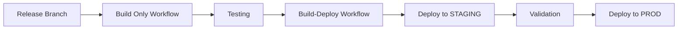

# Deployment Workflows Guide

This document explains the different GitHub Actions workflows available for building and deploying the TodoApp.

## Available Workflows

### 1. 🚀 Build and Deploy (`build-deploy.yml`)
**Purpose**: Manual deployment with full control
**Trigger**: Manual workflow dispatch
**Best for**: Production deployments, testing specific configurations

#### Features:
- Full build-to-deployment pipeline in one workflow
- Environment selection (development/staging/production)
- Optional server URL override
- WhatIf mode for validation
- Comprehensive validation and reporting
- Artifact retention for troubleshooting

#### Usage:
1. Go to GitHub Actions → "Build and Deploy"
2. Click "Run workflow"
3. Select:
   - Environment (development/staging/production)
   - Server URL (optional, uses secrets if empty)
   - WhatIf mode (for validation only)
4. Click "Run workflow"

### 2. ⚡ Auto Deploy (`auto-deploy.yml`)
**Purpose**: Automatic deployment based on git branches
**Trigger**: Push to master/develop branches, or manual trigger
**Best for**: Continuous deployment, development workflow

#### Features:
- Automatic environment selection based on branch:
  - `develop` branch → development environment
  - `master` branch → staging environment
- Manual trigger with environment selection
- Quick build and deploy process
- Environment-specific server configuration via secrets

#### Usage:
**Automatic:**
- Push to `develop` → deploys to development
- Push to `master` → deploys to staging

**Manual:**
1. Go to GitHub Actions → "Auto Deploy"
2. Click "Run workflow"
3. Select environment
4. Click "Run workflow"

### 3. 📦 Build Only (`build.yml`)
**Purpose**: Build and create artifacts without deployment
**Trigger**: Push to master/develop, pull requests
**Best for**: Creating packages for later deployment, testing builds

#### Features:
- Builds application and creates Web Deploy packages
- Runs tests
- Creates deployment artifacts
- Stores packages for later use
- No deployment phase

### 4. 🎯 Deploy Only (`deploy.yml`)
**Purpose**: Deploy pre-built packages
**Trigger**: Manual workflow dispatch
**Best for**: Deploying previously built packages, rollbacks

#### Features:
- Downloads pre-built artifacts
- Deploys specific package versions
- Environment selection
- WhatIf mode support

## Workflow Comparison

| Feature | Build-Deploy | Auto Deploy | Build Only | Deploy Only |
|---------|--------------|-------------|------------|-------------|
| **Trigger** | Manual | Auto/Manual | Auto | Manual |
| **Build** | ✅ | ✅ | ✅ | ❌ |
| **Deploy** | ✅ | ✅ | ❌ | ✅ |
| **Environment Control** | Full | Branch-based | N/A | Full |
| **WhatIf Mode** | ✅ | ❌ | N/A | ✅ |
| **Artifact Storage** | ✅ | ❌ | ✅ | Uses existing |
| **Best For** | Production | Development | CI/Testing | Rollbacks |

## Configuration Requirements

### GitHub Secrets
Configure these secrets in your repository settings:

#### Required for all deployments:
- `DEPLOY_USERNAME`: Web Deploy username (usually "Administrator")
- `DEPLOY_PASSWORD`: Web Deploy password

#### Environment-specific server URLs:
- `DEV_SERVER_URL`: Development server Web Deploy URL
- `STAGING_SERVER_URL`: Staging server Web Deploy URL  
- `PROD_SERVER_URL`: Production server Web Deploy URL

Example:
```
DEV_SERVER_URL: https://dev-server:8172/msdeploy.axd
STAGING_SERVER_URL: https://staging-server:8172/msdeploy.axd
PROD_SERVER_URL: https://prod-server:8172/msdeploy.axd
```

### GitHub Environments
Create these environments in your repository settings for additional security:

1. **development**: No restrictions
2. **staging**: Optional approval requirements
3. **production**: Required reviewers, deployment branches

## Recommended Workflow Strategy

### For Development Teams:


### For Quick Development:


### For Production Releases:


## Workflow Examples

### Example 1: Development Workflow
```bash
# Developer makes changes
git checkout develop
git add .
git commit -m "Add new feature"
git push origin develop

# Auto Deploy workflow triggers automatically
# Deploys to development environment
```

### Example 2: Staging Deployment
```bash
# Code is ready for staging
git checkout master
git merge develop
git push origin master

# Auto Deploy workflow triggers automatically  
# Deploys to staging environment
```

### Example 3: Production Deployment
```bash
# Use Build-Deploy workflow manually
# 1. Go to GitHub Actions
# 2. Select "Build and Deploy"
# 3. Choose:
#    - Environment: production
#    - WhatIf: true (for validation first)
# 4. Run workflow to validate
# 5. Run again with WhatIf: false to deploy
```

### Example 4: Rollback Scenario
```bash
# Use Deploy Only workflow
# 1. Go to GitHub Actions
# 2. Select "Deploy to VM"  
# 3. Choose:
#    - Environment: production
#    - Package Run Number: 123 (previous version)
#    - WhatIf: false
# 4. Run workflow
```

## Troubleshooting

### Common Issues:

#### 1. Missing Server URLs
**Error**: "Server URL not provided and no secret found"
**Solution**: Configure environment-specific secrets (`DEV_SERVER_URL`, etc.)

#### 2. Authentication Failures
**Error**: "Deployment credentials not found"
**Solution**: Set `DEPLOY_USERNAME` and `DEPLOY_PASSWORD` secrets

#### 3. Package Not Found
**Error**: "Package file not found"
**Solution**: Run Build workflow first, or check artifact availability

#### 4. Parameter File Missing
**Error**: "SetParameters file not found"
**Solution**: Verify `parameters/setParameters.{environment}.xml` exists

### Validation Commands:

Check workflow status:
```powershell
# Check if all required secrets are set
gh secret list

# View workflow runs
gh run list --workflow="build-deploy.yml"

# Check specific run details
gh run view {run-id}
```

## Best Practices

### 1. **Environment Progression**
- Always test in development first
- Use staging for final validation
- Deploy to production only after staging approval

### 2. **Use WhatIf Mode**
- Always run WhatIf before production deployments
- Validate parameter substitution
- Check deployment target

### 3. **Monitor Deployments**
- Check application health after deployment
- Monitor logs for errors
- Validate configuration changes

### 4. **Rollback Strategy**
- Keep previous packages for quick rollback
- Test rollback procedures in staging
- Document rollback steps

### 5. **Security**
- Use environment-specific secrets
- Rotate deployment credentials regularly
- Restrict production environment access

This workflow system provides flexibility for different deployment scenarios while maintaining security and reliability. 